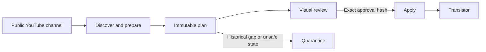

# YouTube to Podcast

[](https://www.python.org/)
[](LICENSE)
[](https://github.com/sunyuzheng/kedaibiao-content-tools/actions/workflows/youtube-to-podcast-validation.yml)

> **From public video to podcast—without rewriting history.**

Built by **Yuzheng Sun（孙煜征 / 课代表立正）** ·
[lizheng.ai](https://www.lizheng.ai)

YouTube to Podcast is a local-first, plan-first tool that turns a public
YouTube channel into a podcast. It prepares audio and transcripts, reconciles
them against an existing show, and gives you a visual review before any remote
write is allowed.

Version 0.1 supports Transistor as its first podcast-host adapter. It was
extracted from the production workflow behind
[课代表立正](https://www.youtube.com/@kedaibiao): a real archive with years of
episodes, subtitles, historical gaps, and ordering constraints.



The central promise is simple: **automation may prepare the decision, but it
cannot silently approve its own publication scope.**

## Why this is different

- `plan` is read-only with respect to Transistor.
- `apply` requires the approval hash printed by that exact plan.
- Any edit to the actions, media, transcript, configuration, or remote
  preconditions makes execution fail closed.
- The default is `incremental + draft`, with at most three actions per plan.
- Historical gaps are quarantined in incremental mode.
- Backfill mode can create drafts, but cannot publish.
- Original YouTube upload dates are preserved when publishing.
- New episodes are created oldest first and their assigned numbers are read back.
- Existing published episodes are never reordered or deleted.
- Existing drafts are surfaced for manual review and never reused automatically.
- Scheduled jobs should run `plan`, never `apply`.

This makes the tool suitable for channels that already have a podcast history,
not just empty shows receiving their first upload.

## Requirements

- Python 3.11 or newer
- `ffmpeg`
- A Transistor API key and numeric show ID
- A public YouTube channel `/videos` URL

## Install

YouTube to Podcast is not on PyPI yet. Install the current open-source version
directly from GitHub:

```bash
python3 -m venv .venv-youtube-to-podcast
. .venv-youtube-to-podcast/bin/activate
pip install \
  "youtube-to-podcast @ git+https://github.com/sunyuzheng/kedaibiao-content-tools.git@main#subdirectory=packages/youtube-to-podcast"
```

Install `ffmpeg` with your operating system's package manager. Because YouTube
changes frequently, upgrade `yt-dlp` explicitly before a run:

```bash
youtube-to-podcast update-ytdlp --pre
```

The tool never silently upgrades itself during `plan` or `apply`.

## Quick start

Create a clean project directory:

```bash
mkdir my-podcast-sync
cd my-podcast-sync

youtube-to-podcast init \
  --channel-url https://www.youtube.com/@YOUR_CHANNEL/videos \
  --show-id YOUR_NUMERIC_TRANSISTOR_SHOW_ID
```

`init` also creates a `.gitignore` that excludes `.env` and runtime media.
Copy `.env.example` to `.env`, then add the secret locally:

```dotenv
TRANSISTOR_API_KEY=replace_me
```

Check the environment and make a plan:

```bash
youtube-to-podcast doctor --online
youtube-to-podcast plan
```

The plan command produces three views of the same immutable scope:

```text
.youtube-to-podcast/plans/latest.json
.youtube-to-podcast/plans/latest.md
.youtube-to-podcast/plans/latest.html
```

Open the interactive local review:

```bash
youtube-to-podcast review
```

The dashboard separates executable actions, non-blocking warnings, and
quarantined items. It supports keyboard navigation, narrow screens, filtering,
and search by title, YouTube ID, or block reason.

If the plan is correct, apply only that exact scope:

```bash
youtube-to-podcast apply \
  --plan .youtube-to-podcast/plans/latest.json \
  --approval-hash HASH_PRINTED_BY_PLAN
```

The default creates drafts only. To allow newly discovered videos to publish
with their original YouTube dates, change `publication = "publish"` and build a
new plan. Do not reuse an old approval hash after changing configuration.

## Configuration

`youtube-to-podcast.toml`:

```toml
schema_version = 1
work_dir = ".youtube-to-podcast"

[youtube]
channel_url = "https://www.youtube.com/@YOUR_CHANNEL/videos"

[transistor]
show_id = "12345"

[policy]
mode = "incremental"
publication = "draft"
max_actions = 3
max_candidates = 12
include_live = false
download_subtitles = true
subtitle_languages = ["en.*", "zh.*"]
```

Modes:

- `incremental`: only considers videos newer than the newest published
  Transistor episode linked by `video_url`. Older missing items are reported as
  historical gaps.
- `backfill`: considers historical gaps, but only as drafts. Review and publish
  them manually or return to an incremental publish plan after establishing a
  trusted baseline.

`max_actions` limits remote mutations in one plan. `max_candidates` separately
bounds YouTube metadata checks, so one blocked candidate does not permanently
starve later valid videos.

## What gets preserved

Human and automatic YouTube subtitles are downloaded when available. SRT is
preferred over VTT, and obvious automatic-caption filenames receive lower
priority. The selected timed-text file stays local; clean plain text is sent to
Transistor as `transcript_text`.

New episodes are created oldest first. After writing, the tool reads back the
episode number, original publication date, audio artifact, thumbnail,
description, YouTube link, and transcript artifact. A write that cannot be
verified is treated as a failure and recorded in a local JSONL ledger.

A missing transcript or description is a visible warning, not an automatic
block. Missing title, publish date, audio, non-public availability, duplicate
remote matches, an existing draft, or unexpected live content blocks the item.

## Privacy and trust

- The project adds no hosted backend and no telemetry.
- Downloaded working files stay local. Only `apply` sends the approved audio,
  metadata, and transcript to your configured Transistor show.
- The Transistor key is read only from the environment or a gitignored `.env`.
- `init` automatically gitignores `.env` and `.youtube-to-podcast/`.
- Plans contain operational metadata—titles, descriptions, show/episode IDs,
  relative paths, and hashes—but never the API key.
- The visual review is a self-contained local HTML file with no external
  JavaScript or analytics.

See [SECURITY.md](SECURITY.md) for the exact execution boundary and disclosure
guidance.

## Weekly automation

A safe weekly scheduler runs only:

```bash
youtube-to-podcast update-ytdlp --pre
youtube-to-podcast doctor --online
youtube-to-podcast plan
```

It may notify a human with `latest.md`. It must not run `apply`, copy an approval
hash automatically, or publish without review.

## Non-goals in 0.1

- Private, members-only, age-gated, or cookie-authenticated YouTube content
- Automatic deletion, duplicate cleanup, or reordering of existing episodes
- Automatic repair or publishing of pre-existing drafts
- Fully unattended publishing
- Podcast hosts other than Transistor
- A hosted service that stores user API keys

## Built from real work

This project is maintained by
[Yuzheng Sun（孙煜征 / 课代表立正）](https://www.lizheng.ai), an
economist-turned-operator and system builder. His work asks how judgment can
meet reality early, learn from feedback, and become a system other people can
use.

YouTube to Podcast is one concrete example: production infrastructure becomes
open source once it is reliable and general enough for someone else to inspect,
adapt, and own.

[lizheng.ai](https://www.lizheng.ai) ·
[YouTube](https://www.youtube.com/@kedaibiao) ·
[Superlinear Academy](https://www.superlinear.academy) ·
[AI Builders](https://ai-builders.com) ·
[Stay Superlinear](https://staysuperlinear.com)

See [CONTRIBUTING.md](CONTRIBUTING.md) before proposing changes.

YouTube to Podcast is not affiliated with YouTube or Transistor.
